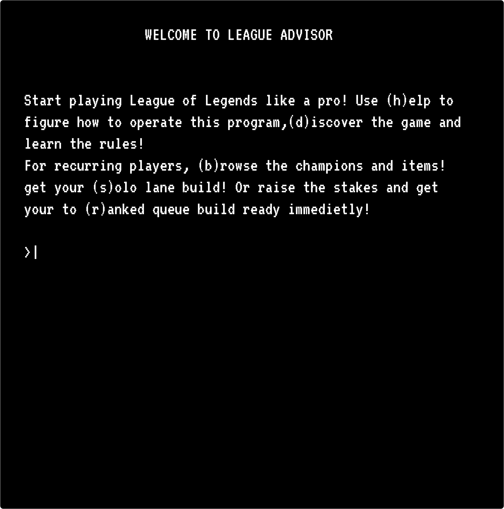
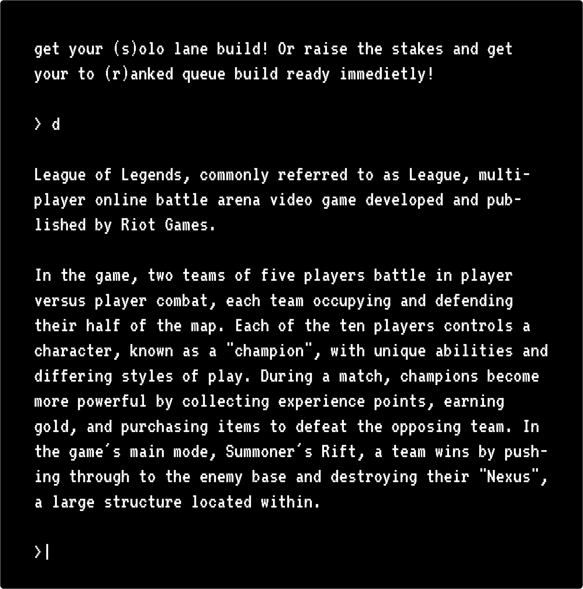
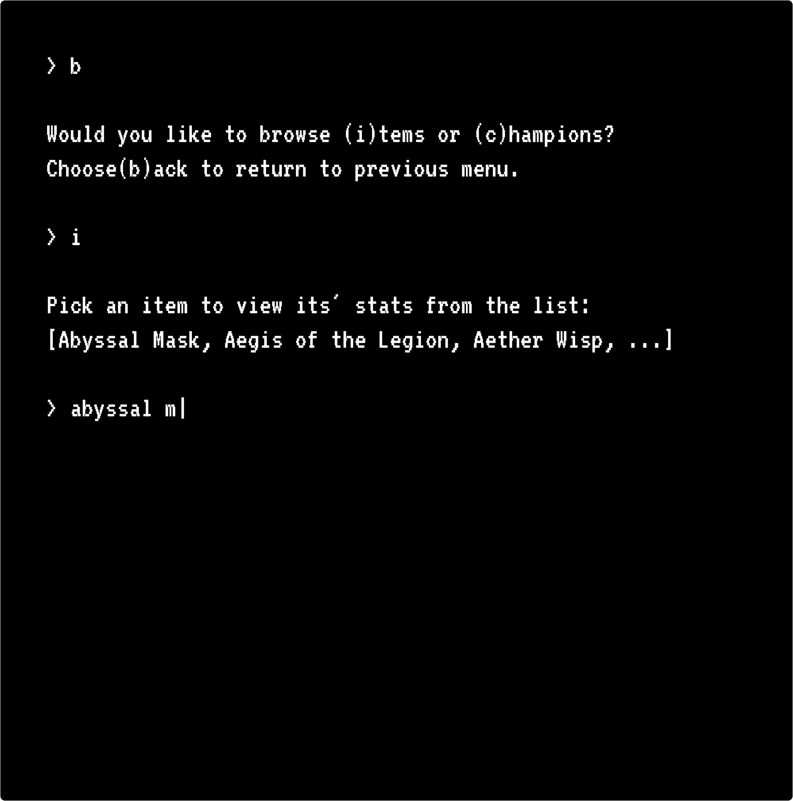
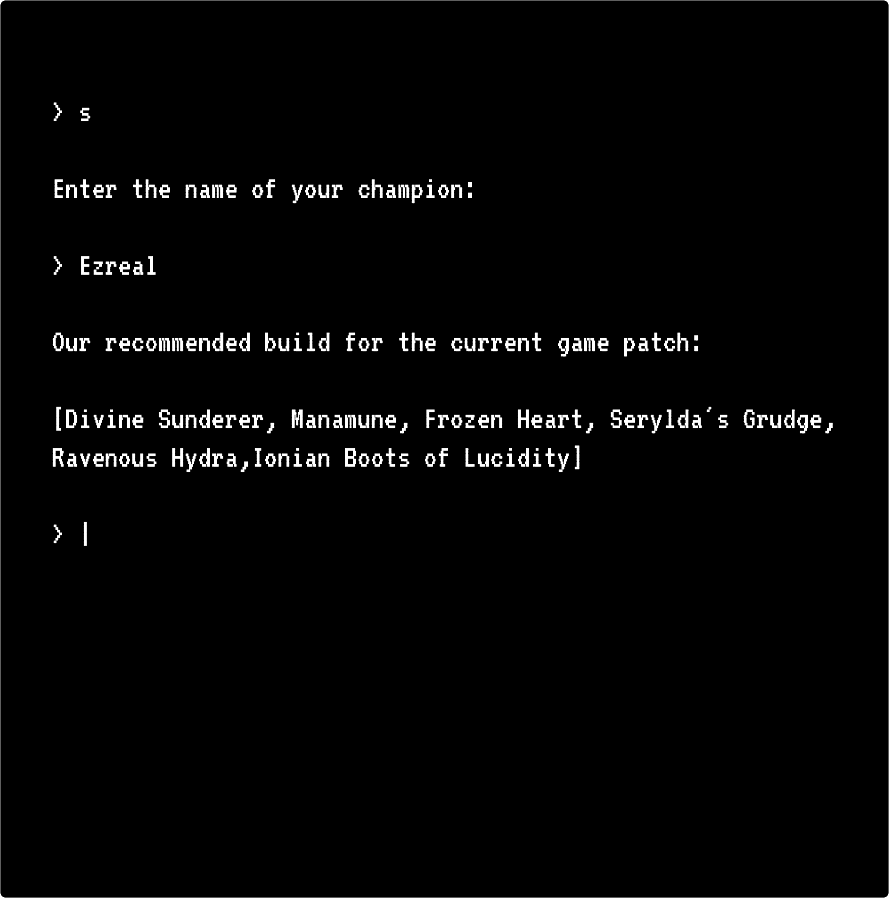
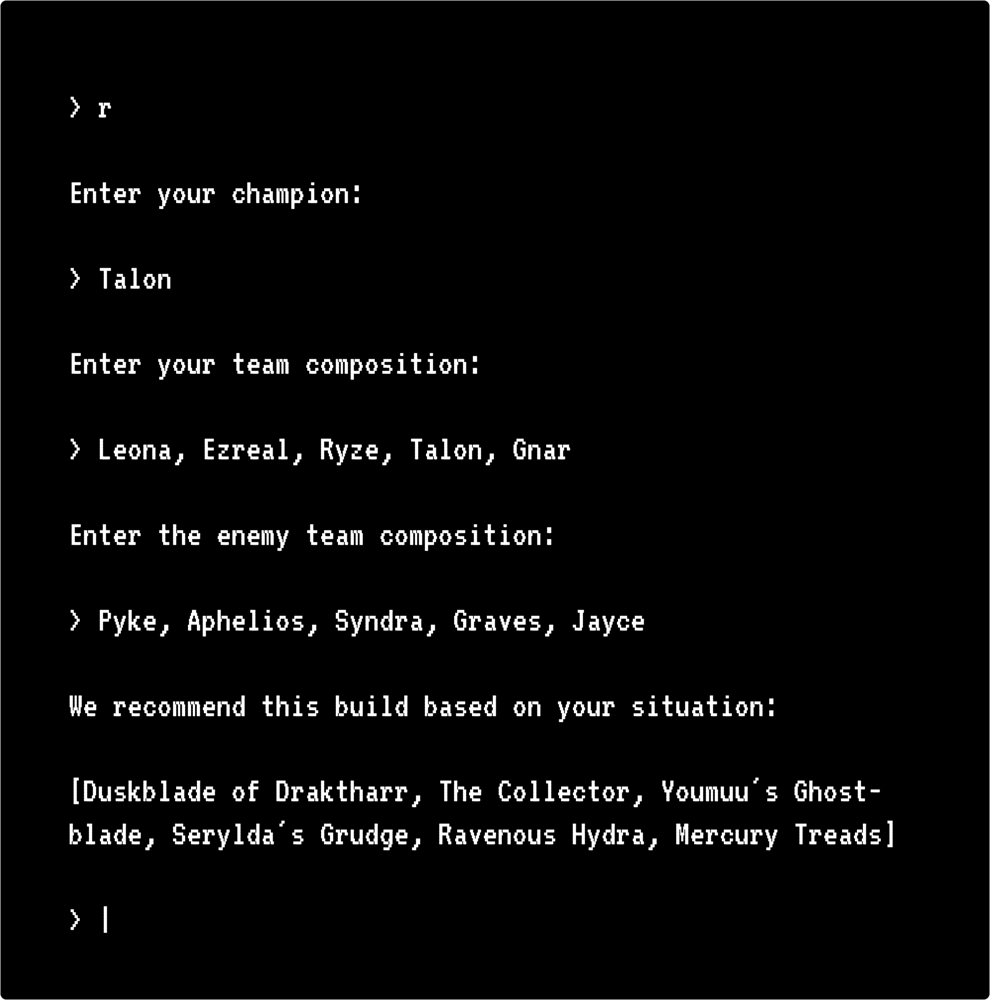
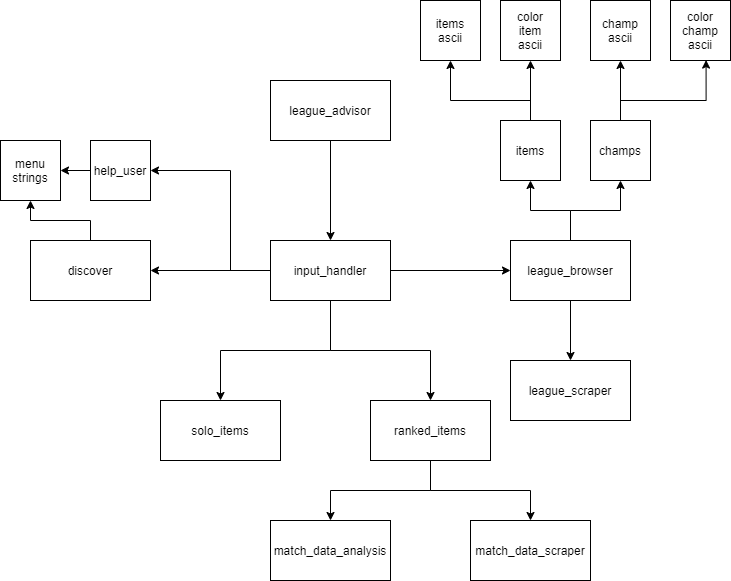

# League Advisor

### We are deployed on **GitHub**!

[League Advisor](https://github.com/League-Advisor/league-advisor)

---

## CLI Program

_This CLI program consists of a frontend written in python._

The program provides recommended item builds based on the user's team and enemy team composition.

_League of Legends is a fast-paced MOBA game, once pre-match stage is complete and enemy team composition is revealed, a player has to start planning their build path for the entire match._

_Every and each champion has an ideal build path that brings out the best of the character, but they still need to keep in mind who are they facing on the opposite side._

_A player often has to do lots of mental math in order to figure out what should they go for and in which order, while keeping in mind the frequent adjustment and changes that champions and items go through almost every other week._

---

## Features and Tests

**_CLI program that provides the following:_**

• Preview the welcoming message and the list of options and ask the user which option he want to preview.

• Preview the Rules of the League of Legends Game if the user choose to preview the rules.

• The user want to preview the champions and the items in the game.

• The user want to preview the optimal items for the champion in General.

• The user want to know which items are optimal with respect to his team champions also with respect to the enemy team champions.

---

## User Stories

[GitHub Projects](https://github.com/orgs/League-Advisor/projects/1)

---

## Wireframes







---

## Domain Model



---

## Tools Used

VS Code
[GitHub Projects](https://github.com/orgs/League-Advisor/projects/1)

```py
- Python
- Pytest
- Poetry
- PyEnv
- pytest-cov
- flake8
- black
- bs4
- Requests
- dotenv
- jupyterlab
- pandas
- difflib
- collections
- builtins

```

---

## Recent Updates

#### V 0.1

_Project created_ - 2 Nov 2021

#### V 0.2

_Software Requirements_ - 3 Nov 2021

#### V 0.3

_User Stories,Domain Model and Wireframes_ - 4 Nov 2021

#### V 0.4

_league_advisor and input_handler modules_ - 5 Nov 2021

#### V 0.4.1

_input_handler unittests and ascii art and color codes- 6 Nov 2021

#### V 0.5

_discover module and unittests_ - 6 Nov 2021


#### V 0.6

_scrape module and unittests_ - 7 Nov 2021

#### V 0.6.1

_browser module and get_items method, receive_user_input_ - 7 Nov 2021

#### V 0.6.2

_receive_champions method for browser module_ - 7 Nov 2021

### V 0.6.2.1

_print champion figures in champion browser_ - 7 Nov 2021

#### V 0.6.3

_added flo simulation logic module_ - 7 Nov 2021

#### V 0.6.4

_adding some simulation tests_ - 7 Nov 2021

### V 0.6.5

_extended champion browser print functionality_ - 8 Nov 2021

#### V 0.6.6

_adding simulation tests for receive_items method_ - 8 Nov 2021

#### V 0.7

_solo_items and unit tests_ -7 Nov 2021

### V 0.8.0

_adding match_data_scraper and ranked_items modules and games data json file_ - 7 Nov 2021

### V 0.8.1

_adding match_scraper, get_match_data_by_id, and filter_match_data methods to match_data_scraper module_ - 8 Nov 2021

### V 0.8.2

*adding data analysis method for ranked module inprogress* - 8 Nov 2021

### V 0.8.3

*extended match_scraper functionality to handle larger data queries and added mroe unittests* - 9 Nov 2021

### V 0.8.4

*data_analyzer method for MatchData class* - 9 Nov 2021

### v 0.8.5

_adding the ranked item module and prompt_user method,handle_user_input method,handle_user_choice method_ - 8 Nov 2021

### V 0.9.0

_implementing color mode in league champion browser feature_ - 9 Nov 2021

### V 0.9.1

_implemented color mode in champions browser_ - 9 Nov 2021

### v 0.9.2

_updating the ranked item module to handle both team and the proper check for them weather in numbers of champions also the repeated champion in both team or repeated name in same team_ - 9 Nov 2021

### V 0.9.3
_adding color mode to other features and polishing them_ - 9 Nov 2021

### V0.9.3.1
_test: adding automated unit tests for input_handler and solo_item modules_ -  9 Nov 2021

### V 0.9.5
_discover module unittests_ - 9 Nov 2021

### V0.9.5.1
_fix: added the ability to test colored text and edited assets_ -  10 Nov 2021

### V 0.9.7
_match data analysis module unittests_ - 9 Nov 2021

### V 0.9.8
_test: recieve_champions method for LeagueBrowser class module unittests_

### V 0.9.9.1
_fix: fixed automated unittests_ - 10 Nov 2021

### V 0.9.9.2
_docs: fixed docstrings_ - 10 Nov 2021

### V 0.9.9.1
_refactor: refactor the ranked module in basic mode and color mode_ - 10 Nov 2021


# V 0.9.9.3
_test: fix the test for match data analysis module after refactoring the module_ - 10 Nov 2021

### v0.9.9.7 
_testing match data analysis module_ - 10 Nov 2021

---

### V 0.9.9.3
_test: added tests for solo champion_ - 10 Nov 2021


### V 0.9.9.4
_""refactor:implementing color mode into ranked champion and formatting prints""_ - 10 Nov 2021

### V 0.9.9.5
_docs: adding domain model image and get started section to the README_- 10 Nov 2021

---

## Getting Started

Clone this repository to your local machine.

```md

Set the program repo locally on your machine: 

`$ git clone git@github.com:League-Advisor/league-advisor.git`

---------------------------------------------------------------

Navigate to the repo's directory and install required  dependencies:

`$ poetry install`

---------------------------------------------------------------

Run the your code editor of choice

`$ code .`

---------------------------------------------------------------

Run poetry shell

`$ poetry shell`

---------------------------------------------------------------

For the first time using the program, or if you have deleted the included data files, go to `match_data_scraper.py` and uncomment the entire module.

Add your RIOT API key to .env file as shown in .env.sample.

Be sure to read the warnings carefully.

Run the module, this step may take some time and cosume data:

`$ python -m league_advisor.match_data_scraper`

Once it's done, comment the module again to avoid running it again by accident.
---------------------------------------------------------------

Run the core module and enjoy your easy access to all you need from LeagueAdvisor:

`$ python -m league_advisor.league_advisor`

```

---

## Change Log

v0.1: _created project repo and setup tooling for project management_ - 2 Nov 2021

v0.2: _docs: Adding the software requermints and adding domain model_ - 3 Nov 2021

v0.3: _docs: Adding user stories ,update domain model and wireframes_ - 4 Nov 2021

v0.4: _feat: adding league_advisor and input_handler modules_ - 5 Nov 2021

v0.4.1: _feat: adding unittests and ascii art and color codes_ - 6 Nov 2021

v0.5: _feat: adding discover module and it's unittests_ - 6 Nov 2021

v0.6: _feat: adding scrape module and it's unittests_ - 7 Nov 2021

v0.6.1: _feat: adding browser module and get_items method, receive_user_input_ - 7 Nov 2021

v0.6.2: _feat: adding receive_champions method for browser module_ - 7 Nov 2021

v06.2.1: _feat: adding champion figures to champion browser_ - 7 Nov 2021

v0.6.1: _feat: adding browser module and receive_items method, receive_user_input_- 7 Nov 2021

v0.6.3: _added flo simulation logic module_ - 7 Nov 2021

v0.6.4: _test: adding some simulation tests_- 7 Nov 2021

v0.6.4.1: _feat: 90% compleated from receive_items method in browser module_- 7 Nov 2021

v0.6.4.2: _test: simulation tests for receive_items method in browser module_- 8 Nov 2021

v0.6.5 _extended champion browser print functionality_ - 8 Nov 2021

v0.6.6 _adding simulation tests for receive_items method_ - 8 Nov 2021

v0.7: _feat: adding solo_items and unit tests_ -7 Nov 2021

v0.8.0: *feat: adding match_data_scraper and ranked_items modules games data json file* - 7 Nov 2021

v0.8.1 _feat: adding match_scraper, get_match_data_by_id, and filter_match_data methods to match_data_scraper module_ - 8 Nov 2021

v0.8.2 *feat : data analysis method for ranked module inprogress*  - 8 Nov 2021

v0.8.3 *feat: extended match_scraper functionality to handle larger data queries and added mroe unittests* - 9 Nov 2021

v0.8.4 *feat : data_analyzer method for MatchData class*  - 9 Nov 2021

v0.8.5 _feat: adding ranked_item, get user choice and comapre it with the list of champions and then send it to data analysis module to pick the optimal items for the user with respect to user team champions also with respect to enemy team champions _ - 8 Nov 2021

v0.9.0: _feat: implementing color mode in league champion browser feature_ - 9 Nov 2021

v0.9.1 _feat: implemented color mode in champions browser_ - 9 Nov 2021

v0.9.2 _feat: updating ranked item module to handle the both user and enemy teams also check if champion names are in the game also check if there is a repeated name in side both team_ - 9 Nov 2021

v0.9.3 _refactor: adding color mode to other features and polishing them_ - 9 Nov 2021

v0.9.3.1 _test: adding automated unit tests for input_handler and solo_item modules_ -  9 Nov 2021

v0.9.5 _test: discover module unittests_ - 9 Nov 2021

v0.9.5.1 _fix: added the ability to test colored text and edited assets_ -  10 Nov 2021

v0.9.7 _test: match data analysis module unittests_ - 10 Nov 2021

v0.9.8 _test: recieve_champions method for LeagueBrowser class module unittests_ - 10 Nov 2021

v0.9.8.1 _fix: fixed automated unittests_ - 10 Nov 2021

v0.9.9.1 refactor: refactor the ranked module in basic mode and color mode_ - 10 Nov 2021

v0.9.8.2 _docs: fixed docstrings_ - 10 Nov 2021

v0.9.9.3 _test: added tests for solo champion_ - 10 Nov 2021

v0.9.9.4 _refactor:implementing color mode into ranked champion and formatting prints_ - 10 Nov 2021

v0.9.9.5 _docs: adding domain model image and get started section to the README_- 10 Nov 2021

v0.9.9.3 test: fix the test for match data analysis module after refactoring the module - 10 Nov 2021


v0.9.9.7 test: testing match data analysis module - 10 Nov 2021


---

## Authors

- Bashar Taamneh
- Du'a Jaradat
- Ehab Ahmad
- Mohammed Al-Hanbali
