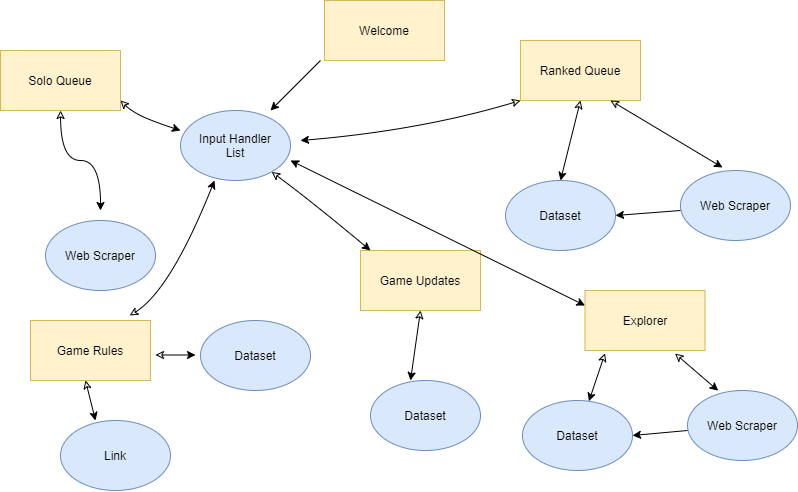

# League Advisor

### We are deployed on **GitHub**!

[League Advisor](https://github.com/League-Advisor/league-advisor)

---

## CLI Program

_This CLI program consists of a frontend written in python._

The program provides recommended item builds based on the user's team and enemy team composition.

_League of Legends is a fast-paced MOBA game, once pre-match stage is complete and enemy team composition is revealed, a player has to start planning their build path for the entire match._

_Every and each champion has an ideal build path that brings out the best of the character, but they still need to keep in mind who are they facing on the opposite side._

_A player often has to do lots of mental math in order to figure out what should they go for and in which order, while keeping in mind the frequent adjustment and changes that champions and items go through almost every other week._

---

## Features and Tests

**_CLI program that provides the following:_**

• Preview the welcoming message and the list of options and ask the user which option he want to preview.

• Preview the Rules of the League of Legends Game if the user choose to preview the rules.

• The user want to preview the champions and the items in the game.

• The user want to preview the optimal items for the champion in General.

• The user want to know which items are optimal with respect to his team champions also with respect to the enemy team champions.

---

## User Stories

[GitHub Projects](https://github.com/orgs/League-Advisor/projects/1)

---

## Wireframes


---

## Domain Model



---

## Tools Used

VS Code
[GitHub Projects](https://github.com/orgs/League-Advisor/projects/1)

- Python
- Pytest
- Poetry
- PyEnv
- pytest-cov
- flake8
- black
- bs4
- requests

---

## Recent Updates

#### V 0.1

_Project created_ - 2 Nov 2021

#### V 0.2

_Software Requirements_ - 3 Nov 2021

#### V 0.3

_User Stories,Domain Model and Wireframes_ - 4 Nov 2021

#### V 0.4

_league_advisor and input_handler modules_ - 5 Nov 2021

#### V 0.4.1

\_input_handler unittests and ascii art and color codes- 6 Nov 2021

#### V 0.7

## _solo_items and unit tests_ -7 Nov 2021

## Getting Started

Clone this repository to your local machine.

```
$ git clone git@github.com:League-Advisor/league-advisor.git

```

---

## Change Log

v0.1: _created project repo and setup tooling for project management_ - 2 Nov 2021

v0.2: _docs: Adding the software requermints and adding domain model_ - 3 Nov 2021

v0.3: _docs: Adding user stories ,update domain model and wireframes_ - 4 Nov 2021

v0.4: _feat: adding league_advisor and input_handler modules_ - 5 Nov 2021

v0.4.1: _feat: adding unittests and ascii art and color codes_- 6 Nov 2021

v0.7: _feat: adding solo_items and unit tests_ -7 Nov 2021

## Authors

- Bashar Taamneh
- Du'a Jaradat
- Ehab Ahmad
- Mohammed Al-Hanbali
